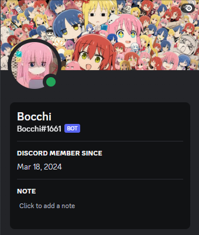

<div align="center">
<br>

# 💡 Bocchi Discord Bot 💡
<br>



</div>
<br>

<p align="center">
  Bocchi is a Discord bot integrated with ChatGPT 3.5, named after the anime character Bocchi the Rock. This bot aims to bring interactive and engaging conversations to your Discord server.
</p>

## 🎯 Features

- Seamlessly integrates with Discord to provide conversational interactions.
- Utilizes the power of OpenAI's ChatGPT 3.5 for generating responses.
- Named after the lovable anime character Bocchi the Rock.
- You can even ask for algorithms to solve problems


## ⚙️ Installation

1. Clone this repository to your local machine.
```bash
git clone https://github.com/n-kyu/bocchi-bot.git
```

2. Install the required packages by running:
```bash
pip install discord
```
```bash
pip install openai
```
3. Create a `.env` file in the root directory of the project.
4. Add the following environment variables to your `.env` file:
```python
DISCORD_BOT_TOKEN=YOUR_DISCORD_BOT_TOKEN
OPENAI_API_KEY=YOUR_OPENAI_API_KEY
```

## 🎉 Usage

Once you've installed the necessary packages and configured your `.env` file, you can start using Bocchi. Simply run the Python script to start the bot:

```bash
python main.py
```


## 🐞 Known Issues

A known issue with the bot occurs when it exceeds the OpenAI API request limit. This causes the bot to loop through previous messages and respond incorrectly. To mitigate this issue, you need to clear Discord channel messages periodically.

## 🚀 Contributing

Contributions are welcome! If you find any bugs or have suggestions for improvements, please open an issue or submit a pull request.

## ⚖️ License

This project is licensed under the MIT License - see the [LICENSE](LICENSE) file for details.

